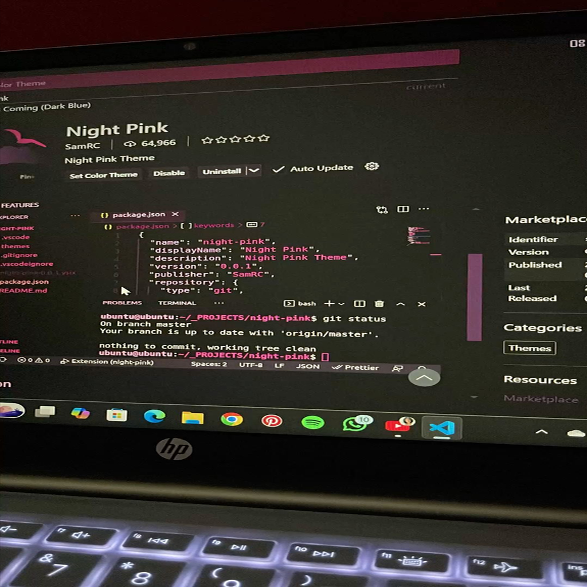
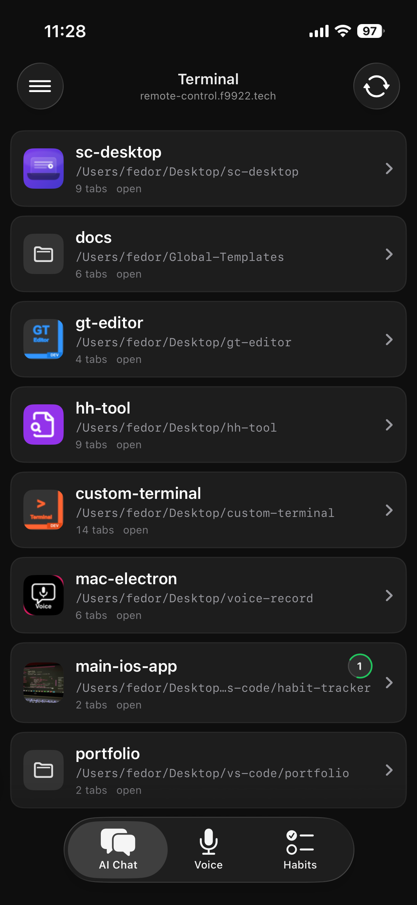
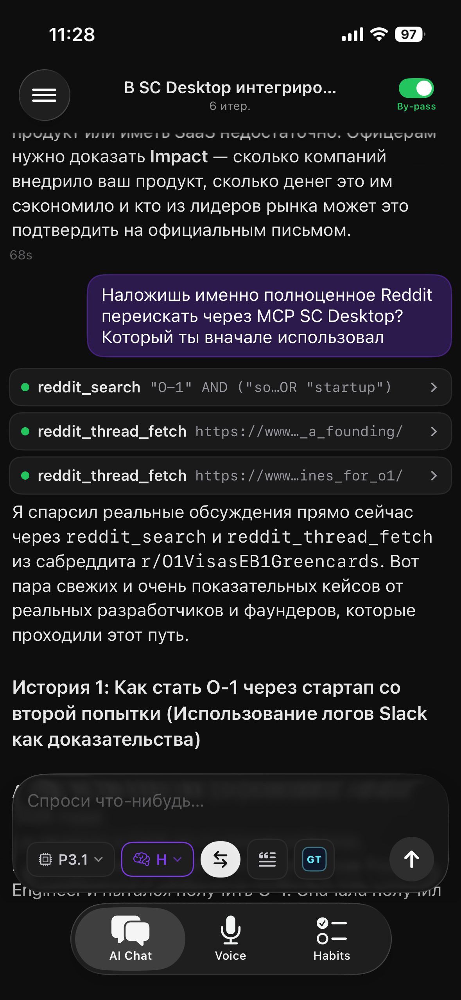
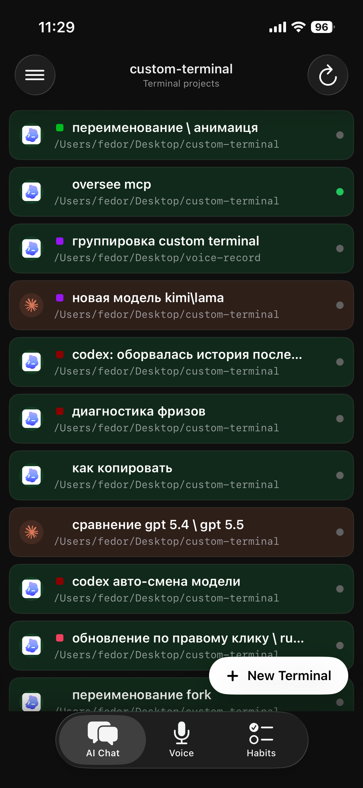

<div align="center">



# Main iOS App

**Native iOS control surface for a Mac-side AI workflow: chat, terminal orchestration, voice capture, and the original habit tracker.**

SwiftUI · REST/SSE · AppIntents · ActivityKit · WidgetKit · Soniox ASR

`iOS 18+` · `Xcode 26` · `Swift / SwiftUI`

<p>
  
  
  
</p>

</div>

---

## What This Is

Main iOS App is a native iPhone client for controlling AI work that actually runs on the user's Mac. The phone does not execute tools, shell commands, MCP calls, or file mutations locally; it talks to Mac-side Electron/Node services over authenticated REST and SSE, renders their live state natively, and gives the user mobile controls for starting, stopping, approving, resuming, and routing work.

The current product center is **AI Chat**. It has two modes in one SwiftUI tab:

- **Voice Record chat**: a native client for the Mac-side Voice Record / Gemini-oriented agent runtime. It sends prompts to `/api/chat/send`, follows turns through SSE, renders thinking/tool/background-task cards, handles confirm gates, and supports a live By-pass switch.
- **Terminal mode**: a native client for `custom-terminal` / Noted Terminal. It lists projects and terminal tabs, opens Claude/Codex/Claude SDK sessions, sends prompts into PTY-backed agent tabs, interrupts/resumes turns, answers pending questions, reads deterministic history, and can trigger the Mac-side build/install job.

Voice recording is still present: a normal dictation flow with Soniox streaming ASR, history, clipboard handoff, Shortcuts / Action Button / Control Center entry points, and Live Activity feedback. Habits is the original app this project started from: a gesture-first habit tracker with widgets and grouped rows. It is still maintained, but it is not the part with the most advanced Apple-platform work anymore.

---

## Architecture

### iOS App

The app is a SwiftUI client with three root tabs: `AI Chat`, `Voice`, `Habits`.

- `VoiceChatStore` owns Voice Record chat state: conversations, running turns, pending confirms, By-pass state, background tasks, SSE reconnects, offline mode, and chat rehydration.
- `TerminalControlStore` owns custom-terminal state: project cache, tab cache, selected tab, params, queue, timeline, history reducer, SSE stream, runtime status, draft recovery, and build/install polling.
- `RecordingCoordinator` owns normal dictation: audio capture, Soniox session, transcript history, AppIntent actions, Live Activity updates, and clipboard handoff.
- `HabitStore` owns the legacy habit datasource shared with widgets through App Group storage.

The stores are intentionally long-lived singletons where live state matters. SwiftUI views are render surfaces, not the source of truth for running AI turns, pending tool confirmations, active terminal sessions, or in-flight voice recording.

### Mac-Side Backends

The iOS app assumes two local/remote Mac services:

| Backend | Role | iOS client |
|---|---|---|
| Voice Record Electron app | Agent chat runtime, prompt library, GT file access, background task output, logs, `/api/chat/*` and `/api/agent/*` | `VoiceChatStore`, `VoiceChatAPI`, `VoiceChatUI` |
| custom-terminal / Noted Terminal | Project/tab inventory, Claude/Codex/SDK PTY sessions, rollout/JSONL history, queue, timeline, `/api/sdk-tabs/*` | `TerminalControlStore`, `TerminalAPI`, `TerminalControlUI` |

The shared auth model is a bearer token in `Secrets.remoteWebToken`. The app uses the token in `Authorization` headers for REST and as a query token for SSE endpoints whose server contract expects EventSource-style auth.

### Transport Model

The app uses REST for snapshots and commands, SSE for live turn/runtime events:

- Voice chat: `/api/chats`, `/api/chats/:id`, `/api/chat/send`, `/api/chat/stop`, `/api/chat/confirm`, `/api/chat/bypass`, `/api/events`.
- Terminal mode: `/api/projects`, `/api/projects/:id/tabs`, `/api/projects/:id/agent-tabs`, `/api/sdk-tabs/:id/send`, `/interrupt`, `/stop`, `/resume`, `/draft`, `/history`, `/events`.
- Install flow: iOS asks custom-terminal for `/api/active-loaders`; if no tab is currently running, it starts `/api/terminal/build-install` through the Voice Record host, because custom-terminal can restart during its own install.

The important constraint: the phone is a controller, not an agent host. Bash, MCP, file edits, Reddit search, GT file reads, and terminal PTY interaction happen on the Mac.

---

## AI Chat

AI Chat is native SwiftUI, not a `WKWebView`. It renders message history, tool calls, thinking blocks, stopped partial answers, background tasks, prompt chips, GT file attachments, and confirm cards directly in iOS.

Key mechanics:

- **SSE watchdog and rehydrate**: stale streams are detected by heartbeat silence; reconnect reloads active chats and pending confirm cards from server state.
- **Confirm cards**: when By-pass is off, mutating tools park on the Mac and appear as pinned mobile cards. Allow/Deny is sent back through `/api/chat/confirm`.
- **Live By-pass**: the toolbar toggle is per-chat server state, not just a send-time parameter. Flipping it mid-turn updates `/api/chat/bypass` and can unblock pending tool calls.
- **Stop semantics**: if the model has already produced thinking/tool artifacts, the partial assistant message remains visible as stopped instead of being silently rolled back.
- **Prompt and GT integration**: prompt picker, model/thinking presets, GT source browsing, file chips, and custom emoji rendering are native iOS controls backed by Mac-side APIs.
- **Diagnostics**: iOS chat logs are sent to the Mac through `/api/log` and also kept in a local phone buffer for settings diagnostics.

---

## Terminal Mode

Terminal mode lives inside the AI Chat tab, not as a separate root tab. The drawer switches between `Chats` and `Terminal`; the central surface then becomes a native custom-terminal client.

It has three navigation levels:

1. project list from `/api/projects`;
2. tab list from `/api/projects/:id/tabs`;
3. native transcript/composer for one Claude/Codex/SDK tab.

This is not a web mirror. The mobile client understands the terminal data model:

- project order, icons, active counts, status markers, and runtime loaders;
- Claude JSONL history and Codex rollout-style history normalized into a common row model;
- tab params for model / effort / thinking;
- queue and run-after state;
- timeline entries;
- pending questions from CLI agents;
- draft recovery after interrupt.

The draft recovery is deliberately conservative. After `Stop`, iOS waits for deterministic runtime reasons such as `interrupt`, `turn_aborted`, or `catch-up-turn_aborted`, then probes `/api/sdk-tabs/:id/draft`. It only restores text that is actually back in the terminal TUI composer; it does not blindly reinsert the last prompt from local memory.

Creating a terminal tab goes through custom-terminal:

- Codex: `/api/projects/:id/agent-tabs` with `toolType=codex`;
- Claude PTY: `/api/projects/:id/agent-tabs` with `toolType=claude`;
- Claude SDK: `/api/projects/:id/sdk-tabs`.

The result is a real Mac-side terminal/session. The iPhone controls it, but the process tree, filesystem access, and agent runtime remain on the Mac.

---

## Voice

Voice is a normal speech-to-text recorder built around Soniox WebSocket ASR. It supports in-app recording, Shortcuts, Control Center, Action Button, clipboard handoff, transcript history, audio sharing, and Live Activity status on Lock Screen / Dynamic Island.

The audio path is designed for iOS realities:

- `AVAudioSession` calls are isolated away from the main thread because category/input changes are synchronous and can block on Bluetooth route negotiation.
- Recording does not stop just because Soniox or the network is unavailable; audio capture is the source of truth, recognition is an attached service.
- Stop uses Soniox's empty text-frame finalize handshake and waits for final tokens instead of cutting off the tail.
- The microphone picker distinguishes intent from actual `currentRoute` so UI cannot claim AirPods are the input when iOS is actually recording from the iPhone mic.

---

## Habits

Habits is the original version of the application: a local gesture-first tracker with grouped habits, week/relative history, reorder gestures, and home-screen widgets. It explains where the project started, but today it is mostly a stable local feature rather than the main technical focus.

---

## Project Layout

```text
habit-tracker/
├── HabitTrackerSwift/
│   ├── HabitTracker/                 # Main iOS app
│   │   ├── Models/                   # Habit models and store
│   │   ├── Remote/                   # Legacy WKWebView/custom-terminal wrapper + RemoteConfig
│   │   ├── Views/                    # SwiftUI app surfaces
│   │   └── VoiceRecord/
│   │       ├── VoiceChat*.swift      # Native AI Chat client
│   │       ├── TerminalControl*.swift# Native custom-terminal client
│   │       ├── Recording*.swift      # Voice recording coordinator + Live Activity manager
│   │       ├── DictationSession.swift
│   │       ├── MicCaptureHub.swift
│   │       └── TranscriptStore.swift
│   ├── HabitWidget./                 # Widgets, controls, Live Activity, AppIntents
│   └── HabitTracker.xcodeproj
├── assets/
│   └── readme/                       # README screenshots
├── docs/
│   ├── knowledge/                    # fact-* and fix-* project knowledge
│   └── methodology/                  # cross-project design/debugging principles
├── scripts/ai/                       # semantic docs index tooling
├── deploy.sh                         # wireless build + install to iPhone
├── CLAUDE.md                         # source-of-truth agent instructions
├── AGENTS.md / GEMINI.md             # generated mirrors
└── .semantic-index.json              # generated docs search index
```

---

## Requirements

- macOS with **Xcode 26**.
- iPhone on iOS 18+; the project is developed against iOS 26 devices.
- Apple ID signing. A free Apple ID works, but the provisioning profile expires after 7 days.
- A paired iPhone for wireless install through `devicectl`.
- Soniox API key if you want voice transcription.
- Running Mac-side services if you want AI Chat / Terminal mode:
  - Voice Record Electron app exposing the chat REST/SSE API;
  - custom-terminal / Noted Terminal exposing project/tab and SDK-tab APIs;
  - the shared remote web token configured on both sides.

---

## Secrets

`Secrets.swift` is intentionally gitignored. Create it locally:

```swift
import Foundation

enum Secrets {
    static let sonioxAPIKey = "soniox_api_key"

    // Voice Record chat host.
    static let voiceChatProdURL = "https://your-voice-record-host.example"
    static let voiceChatDefaultDevHost = "http://192.168.1.10:7878"

    // Legacy RemoteConfig / custom-terminal host.
    static let remoteProdURL = "https://your-custom-terminal-host.example"
    static let remoteDefaultDevHost = "http://192.168.1.10:7878"

    // Shared bearer token used by Voice Chat and Terminal mode.
    static let remoteWebToken = "token_from_mac_side_service"
}
```

Expected path:

```bash
HabitTrackerSwift/HabitTracker/VoiceRecord/Secrets.swift
```

If you only want to build the habit/voice UI without remote AI features, the URL/token values can be placeholders, but any screen that calls the Mac APIs will fail offline until the services are configured.

---

## Build And Install

Open the project in Xcode:

```bash
open HabitTrackerSwift/HabitTracker.xcodeproj
```

Or install to a paired iPhone over Wi-Fi:

```bash
./deploy.sh
```

Useful deploy commands:

| Command | Purpose |
|---|---|
| `./deploy.sh` | Diagnose device/network, build Release, install to iPhone. |
| `./deploy.sh --check` | Device/network diagnostics only. |
| `./deploy.sh --renew` | Reissue the free 7-day provisioning profile, then build/install. |

Deploy logs go to `deploy-logs/`.

---

## Documentation Model

The repository uses `docs_search` and `.semantic-index.json` as the main documentation router. `docs/knowledge/` files are constraints: they capture subsystem behavior, known platform traps, and fixes that should not be rediscovered.

Important docs:

- [`docs/knowledge/fact-voice-chat-tab.md`](docs/knowledge/fact-voice-chat-tab.md) — native AI Chat and Terminal mode.
- [`docs/knowledge/fact-remote-tab.md`](docs/knowledge/fact-remote-tab.md) — RemoteConfig and legacy WKWebView/custom-terminal wrapper.
- [`docs/knowledge/fact-voice-record.md`](docs/knowledge/fact-voice-record.md) — normal voice recording, AppIntents, Live Activity, Soniox.
- [`docs/knowledge/fact-habit-tracker.md`](docs/knowledge/fact-habit-tracker.md) — habits gestures and widgets.
- [`docs/methodology/сценарии-использования.md`](docs/methodology/сценарии-использования.md) — end-to-end user flows.

Rebuild the semantic index after documentation changes:

```bash
bash scripts/ai/build-index.sh
```

---

## License

Personal project. No public license is defined.
