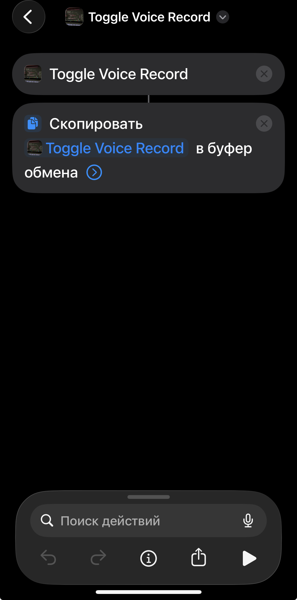

<div align="center">


# Habit Tracker

**Нативное iOS-приложение: трекинг привычек через жесты + голосовая диктовка с Live Activity.**

SwiftUI · WidgetKit · ActivityKit · AppIntents · Soniox ASR

`iOS 17+` · `Xcode 26` · `Swift / SwiftUI`

</div>

---

## Что это

Приложение из **двух параллельных подсистем**, переключаемых вкладками:

- **🎙 Voice** (первая вкладка, открывается по умолчанию) — запись микрофона → потоковое распознавание речи через [Soniox](https://soniox.com) WebSocket → транскрипт в буфер обмена и историю. Управляется не только из приложения, но и из **Пункта управления**, **Shortcuts** и боковой кнопки iPhone (Action Button) — даже когда приложение закрыто. Во время записи на Lock Screen и в Dynamic Island живёт **Live Activity** с таймером и кнопками Stop/Cancel.
- **✅ Habits** (вторая вкладка) — список привычек, сгруппированных в группы. Никакого режима «Edit»: всё через жесты — тап по чекмарку переключает день, долгое нажатие открывает редактирование, drag меняет порядок и переносит между группами. Прогресс отображается матрицей дней и дублируется в виджеты на домашнем экране.

Данные приложения и виджетов живут в общем контейнере **App Group** (`UserDefaults` + JSON-дамп), поэтому виджет и Voice-расширение читают то же состояние, что и основное приложение.

---

## Возможности

### Привычки
- **Gestures-first**, без кнопки Edit: tap / long-press / drag различаются временем и движением.
- Группировка привычек, reorder внутри и между группами.
- Два режима истории: привязка к календарной неделе или «относительно сегодня».
- **Виджеты** 2×2 и 4×2 с мгновенной перезагрузкой при отметке привычки.

### Голос
- Потоковое распознавание речи (Soniox WebSocket ASR), результат — в буфер обмена + история транскриптов.
- **Холодный запуск** записи из Пункта управления / Shortcuts / Action Button через `AppIntents` — без ручного открытия приложения.
- **Live Activity** на Lock Screen и в Dynamic Island: фаза (starting / recording / stopping), таймер, интерактивные кнопки.
- Picker источника микрофона прямо на экране записи с отображением текущего входа в реальном времени.

---

## Стек

| Слой | Технология |
|---|---|
| UI | SwiftUI (iOS 17+ приложение, iOS 18+ виджет-расширение) |
| Хранение | `UserDefaults` + JSON в App Group `group.com.fedor277.habittracker` |
| Виджеты | WidgetKit (Liquid Glass, `contentMarginsDisabled` + `widgetAccentable`) |
| Live Activity | ActivityKit (Dynamic Island + Lock Screen + Notification Center) |
| Точки входа | AppIntents (Shortcuts / Action Button / Control Center) |
| Распознавание речи | Soniox WebSocket ASR |
| Сборка/деплой | Xcode 26, `xcodebuild` + `devicectl` (беспроводно через `./deploy.sh`) |

---

## Требования

- **Mac** с установленным **Xcode 26** (проверено на 26.4.1).
- **iPhone** на iOS 17+ (разрабатывалось и деплоилось на iOS 26.x). Один раз должен быть спарен с Mac по USB — дальше работает по WiFi.
- **Apple ID** для подписи — достаточно бесплатного (профиль живёт 7 дней, см. ниже). Платный аккаунт разработчика не обязателен.
- Хотя бы **один iOS Simulator runtime** установлен в Xcode — `xcodebuild` без него отказывается компилировать даже под физический iPhone (версия симулятора совпадать с iPhone не обязана).
- **Soniox API key** для распознавания речи — получить на [console.soniox.com](https://console.soniox.com). Без него собирается и работает всё, кроме самой транскрипции.

---

## Установка и запуск

### 1. Клонировать и добавить ключ Soniox

`Secrets.swift` намеренно **не** в репозитории (он в `.gitignore`). Создай его вручную:

```bash
cat > HabitTrackerSwift/HabitTracker/VoiceRecord/Secrets.swift <<'EOF'
import Foundation

// Получить ключ: https://console.soniox.com
enum Secrets {
    static let sonioxAPIKey = "ВСТАВЬ_СВОЙ_КЛЮЧ"
}
EOF
```

### 2. Открыть в Xcode (обычный путь)

```bash
open HabitTrackerSwift/HabitTracker.xcodeproj
```

Дальше в Xcode: выбрать свою команду подписи (Signing & Capabilities → Team), выбрать iPhone как destination, нажать **Run** (⌘R).

> Bundle ID нужно сделать уникальным под свой Apple ID, если `com.habittracker.swift` занят. Меняется в настройках таргетов `HabitTracker` и `HabitWidget`. App Group (`group.com.fedor277.habittracker`) тоже надо заменить на свой и обновить константу в коде.

### 3. Или — беспроводный деплой одной командой

Если iPhone уже спарен и в той же WiFi-сети — открывать Xcode не нужно:

```bash
./deploy.sh
```

Скрипт сам: проверит окружение → продиагностирует устройство и сеть → соберёт Release → установит на iPhone по WiFi. При необходимости поднимает фоновые сервисы CoreDevice и закрывает Xcode за собой, если запускал его сам.

---

## Скрипты

| Команда | Что делает |
|---|---|
| `./deploy.sh` | Полный цикл: диагностика → сборка → установка на iPhone по WiFi. |
| `./deploy.sh --check` | Только диагностика устройства и сети, без сборки. |
| `./deploy.sh --renew` | Принудительно выпускает свежий 7-дневный профиль (сбрасывает счётчик до 7 дней). Данные на iPhone сохраняются — это upgrade-install, не wipe. |
| `bash scripts/ai/build-index.sh` | Пересобирает семантический индекс документации (`.semantic-index.json`) для AI-поиска. |

Логи каждого деплоя складываются в `deploy-logs/` (в `.gitignore`).

### Про 7-дневный цикл бесплатного Apple ID

Provisioning-профиль бесплатного Apple ID живёт **7 дней**. После — иконка приложения становится с крестиком, запуск выдаёт «Untrusted Developer». Лечится повторным `./deploy.sh`. Важно: обычный деплой **не** сбрасывает счётчик, пока профиль ещё валиден (`xcodebuild` переиспользует кэш) — чтобы обнулить до 7 дней досрочно, используй `./deploy.sh --renew`. Удалять приложение с iPhone руками **не нужно** — это сотрёт историю.

---

## Запуск записи боковой кнопкой (Action Button)

Запись голоса можно повесить на боковую кнопку iPhone 15 Pro и новее — нажатие будет переключать запись, даже когда приложение закрыто. Настраивается через приложение **Команды** (Shortcuts):

<div align="center">

</div>

1. Открой **Команды** → создай новую команду (`+`).
2. Добавь действие **Toggle Voice Record** (ищется в поиске действий — его поставляет само приложение).
3. Добавь второе действие **Скопировать в буфер обмена** и передай в него вывод первого (`Toggle Voice Record`). Это нужно, потому что фоновый intent **не может** сам писать в буфер обмена — iOS это запрещает; поэтому действие возвращает текст, а Copy-to-Clipboard его забирает.
4. Назначь команду на боковую кнопку: **Настройки → Боковая кнопка → выбери эту команду.**

Теперь нажатие боковой кнопки стартует/останавливает запись, а распознанный текст оказывается в буфере обмена. Аналогично команду можно вызвать из Пункта управления или по голосу через Siri.

> Если в Shortcuts действие отображается как «Неизвестное действие» — переустанови приложение через `./deploy.sh` и перезапусти Shortcuts. `AppShortcutsProvider` должен жить в основном таргете приложения, иначе Shortcuts.app его не просканирует.

---

## Структура проекта

```
habit-tracker/
├── HabitTrackerSwift/
│   ├── HabitTracker/            # Основное приложение
│   │   ├── Models/              #   Habit, HabitGroup, HabitStore, DateHelper
│   │   ├── Views/               #   Экраны, шторки, компоненты
│   │   │   ├── Sheets/          #     Add/Edit привычек и групп, настройки
│   │   │   └── VoiceRecord/     #     UI вкладки голоса, mic-picker, история
│   │   └── VoiceRecord/         #   Логика записи: Coordinator, аудио-сессия,
│   │                            #   Soniox-сессия, Live Activity manager
│   ├── HabitWidget./            # Расширение виджетов + Live Activity + AppIntents
│   └── HabitTracker.xcodeproj
├── docs/                        # Документация (см. ниже)
│   ├── knowledge/               #   fact-*.md (механика) + fix-*.md (шрамы)
│   └── methodology/             #   Переносимые принципы (дизайн, диагностика)
├── scripts/ai/                  # build-index.sh — семантический индексатор docs
├── deploy.sh                    # Беспроводная сборка + установка
├── CLAUDE.md                    # Точка входа для AI: инструкции + anti-patterns
└── .semantic-index.json         # Индекс для поиска по docs (генерируется)
```

> Имя папки виджета `HabitWidget.` — с точкой на конце — историческое, так заведено в Xcode-проекте.

---

## Документация

Документация в этом репозитории устроена под **разработку с AI-ассистентом** и следует единому стандарту. Это не просто заметки — это база знаний, из которой AI автоматически подтягивает нужный контекст перед изменением кода.

### `docs/knowledge/` — основная база

Плоская папка с файлами двух типов:

- **`fact-*.md`** — *как работает* подсистема: поведение фич, edge-cases, ограничения платформы, карта кода. Например [`fact-voice-record.md`](docs/knowledge/fact-voice-record.md), [`fact-live-activity.md`](docs/knowledge/fact-live-activity.md), [`fact-wireless-deploy.md`](docs/knowledge/fact-wireless-deploy.md).
- **`fix-*.md`** — *шрамы*: баги, которые потребовали 3+ итераций отладки, отброшенные подходы и контринтуитивные решения. Например [`fix-dynamic-island.md`](docs/knowledge/fix-dynamic-island.md), [`fix-background-intent-crashes.md`](docs/knowledge/fix-background-intent-crashes.md).

### `docs/methodology/` — переносимые принципы

Философия, применимая в любом проекте: [`переносимый-дизайн.md`](docs/methodology/переносимый-дизайн.md) (UX-принципы), [`диагностика-apple.md`](docs/methodology/диагностика-apple.md) (как детерминированно диагностировать Apple-tooling), [`сценарии-использования.md`](docs/methodology/сценарии-использования.md) (пошаговые user-flow через состояния системы).

### Как это активируется

`.semantic-index.json` + MCP-инструмент `docs_search` дают **семантический поиск по симптому**: AI описывает проблему («запись виснет на стопе», «Activity не видна в Dynamic Island») — Haiku-роутер возвращает 2–4 релевантных файла. Ручных ссылок-каталогов не требуется, обнаружение идёт по тегам и симптомам.

Индекс пересобирается после изменения документации:

```bash
bash scripts/ai/build-index.sh
```

[`CLAUDE.md`](CLAUDE.md) — точка входа: процессные инструкции (читай knowledge перед изменением подсистемы), обзор стека и **anti-patterns** с привязкой к коду. `AGENTS.md` и `GEMINI.md` — автогенерируемые зеркала `CLAUDE.md` для других AI-инструментов, источник правды один.

---

## Лицензия

Личный проект. Лицензия не определена — перед использованием уточни у автора.
